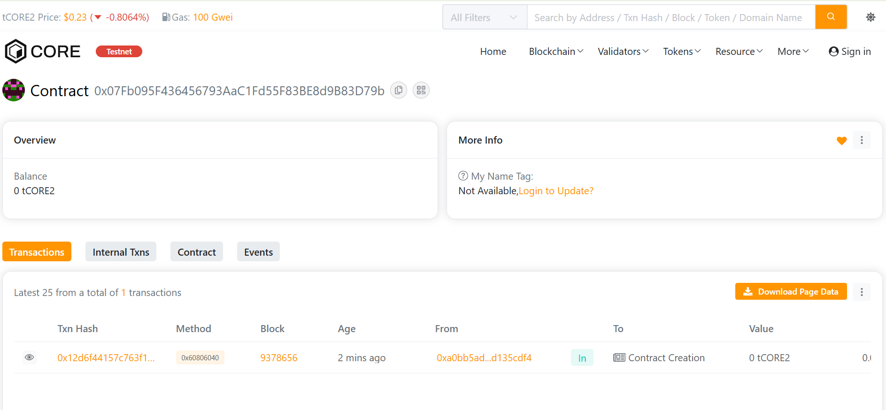

# InfiniteChain

## 🧩 Project Description
**InfiniteChain** is a decentralized blockchain protocol designed to enable secure **user registration, token minting, and peer-to-peer transfers**. It lays the foundation for scalable on-chain ecosystems that prioritize transparency and inclusivity.

---

## 🎯 Project Vision
To establish an open blockchain network where users can **create, share, and transact infinitely**, empowering communities to build sustainable digital economies without intermediaries.

---

## ✨ Key Features
- **User Registration:** On-chain user onboarding system.
- **Token Minting:** The contract owner can mint tokens for registered users.
- **Peer-to-Peer Transfers:** Secure token transfers between users.
- **Transparency:** All operations are recorded immutably on the blockchain.

---

## 🔮 Future Scope
- Add **staking and yield rewards** for token holders.  
- Integrate **multi-chain support** for interoperability.  
- Develop a **DAO-based governance model** for community control.  
- Build a **frontend dApp** for seamless interaction.

---

Address: 0xa0bb5ad19b2966518d3b196f219dbe87d135cdf4

